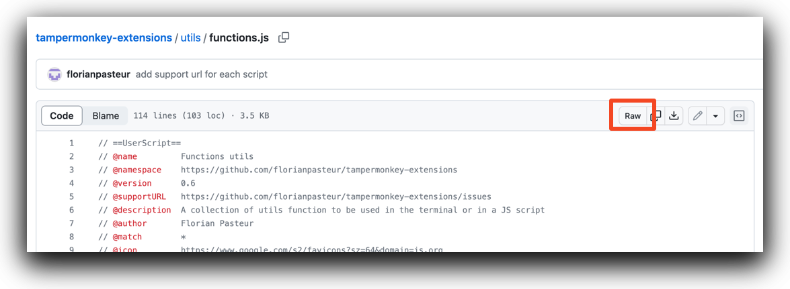
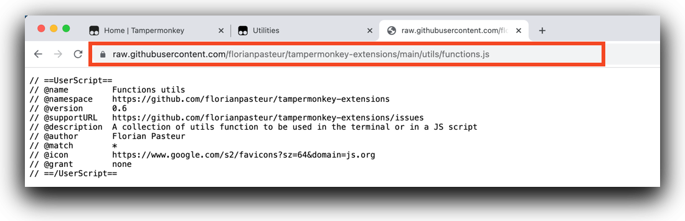
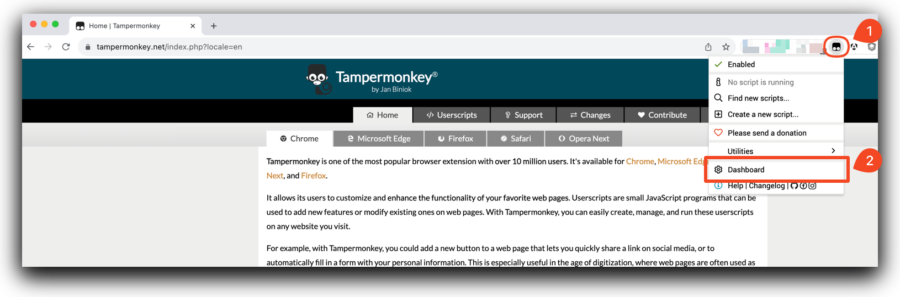
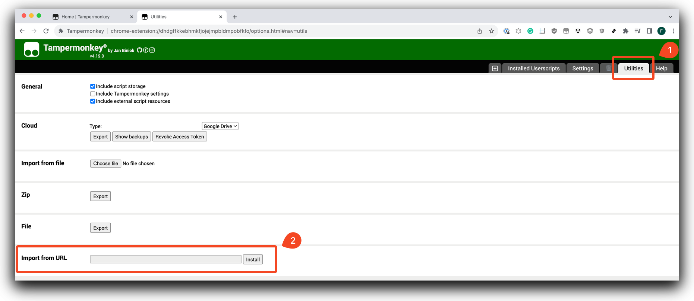
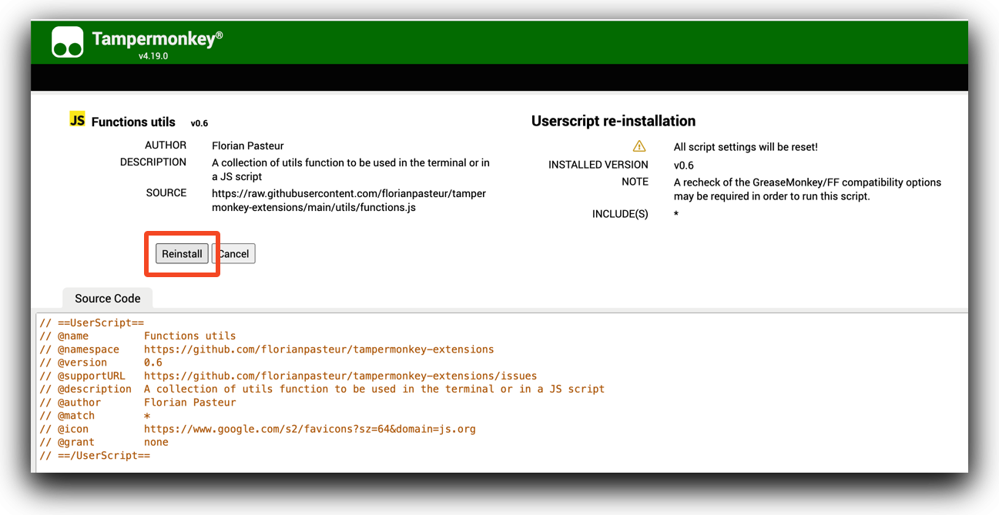
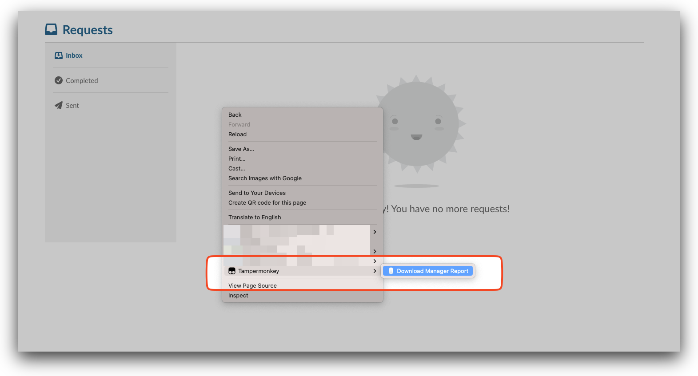
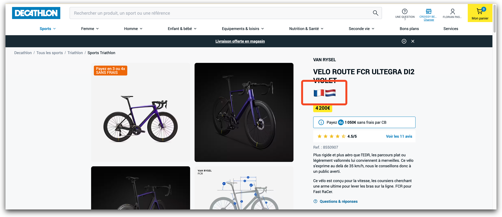
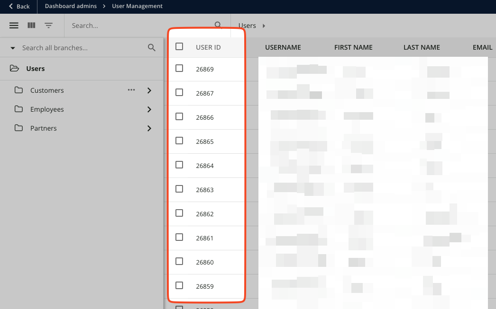

# Tampermonkey Extensions

Bunch of extensions for Tampermonkey

# Installation

- Install Tampermonkey extension:
- https://www.tampermonkey.net/index.php?locale=en

Once the extension is installed to add a script:

- Browse this repository and select the script you'd like to install. (Refer to this documentation to find the corresponding script you need)
- On the script page click on **Raw**

- Copy the URL in your clipboard

- Click on the extension icon of the browser
- Select **Dashboard**

- Go to the **Utilities tab**
- Paste the URl in the **Import from URL** field
- Click **Install**

On the confirmation screen
- Click **Install** (or Re-Install, Update)

# Scripts

Below is the list of available scripts in this repository:

<!-- start-living-doc -->

## Download Manager Report // version 0.31 

Download manager hierarchy per user

[download-manager-hierarchy.js](bamboohr/download-manager-hierarchy.js)

----

## Workout extra data // version 0.2 

Adds more data to the workout preview in campus coach, such as pace, distance at the beginning of block

[workout-extra-data.js](campus-coach/workout-extra-data.js)

----

## Decathlon country links // version 0.5 

Create a link to jump between dutch and french website of decathlon on the same product

[decathlon-country-links.js](decathlon-country-links/decathlon-country-links.js)

----

## UserId on User search docebo // version 0.5 

Add user id on the search table of users

[user-id-on-users-search.js](docebo/user-id-on-users-search.js)

----

## Rise Content Downloader // version 0.6 

Download rise course content as markdown files

[copy-lesson-content.js](rise/copy-lesson-content.js)

----

## Get rise-schema.json content // version 0.3 

Copy list of lessons to be paste on the rise-schema.json for a markdown-to-rise-import

[copy-rise-schema.js](rise/copy-rise-schema.js)

----

## Rise insert wistia transcript // version 0.10 

Insert wistia transcript at caret

[insert-wistia-transcript.js](rise/insert-wistia-transcript.js)

----

## Edit page // version 0.7 

Make entire page editable, useful to change data before taking screenshot

[edit-html-page.js](utils/edit-html-page.js)

----

## Functions utils // version 0.6 

A collection of utils function to be used in the terminal or in a JS script

[functions.js](utils/functions.js)

----

## Zwift Fan Activity watcher // version 0.3 

undefined

[activity-watcher.js](zwift/activity-watcher.js)

----

<!-- end-living-doc -->

